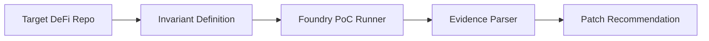

# InvariantLab

AI-assisted DeFi invariant discovery and Foundry-based exploit verification agent.

InvariantLab is a hackathon PoC for converting DeFi security reasoning into an execution decision. It focuses on economic invariants such as vault launch state, share accounting, total assets, oracle value, liquidation debt, and settlement state.

The current demo models a vault launch invariant:

```text
A newly deployed vault must not accept the first external share before setup and activation are complete.
```

## Why It Matters

Many DeFi bugs are not isolated code mistakes. They are broken accounting relationships. InvariantLab turns those relationships into a reproducible loop: define the invariant, run a PoC, parse the result, and output the measured impact plus a patch recommendation.

## Demo

Run the public sample:

```bash
python3 scripts/invariantlab_demo.py --sample
```

Expected summary:

```text
tests: 5 passed
reported_protocol_nav: 1208925819614629174706176
attacker_profit_excluding_1_wei: 604462909807314587353087
stuck_cached_total_assets: 604462909807314587353088
agent_decision: BLOCK
```

Run against a private Foundry PoC:

```bash
python3 scripts/invariantlab_demo.py \
  --target-repo /path/to/foundry-repo \
  --poc-file /path/to/InvariantPoC.t.sol \
  --match-path test/unit-test/InvariantPoC.t.sol
```

JSON output:

```bash
python3 scripts/invariantlab_demo.py --sample --json
```

Agent decision output:

```bash
python3 scripts/invariantlab_demo.py --sample --agent-check
```

Demo video asset:

```text
demo/invariantlab-demo.mp4
```

Logo:

```text
assets/invariantlab-logo-480.png
```

## Architecture



The MVP keeps invariant selection human-reviewed. Execution and evidence parsing are automated.

## Hackathon Fit

Project name:

```text
InvariantLab
```

Tagline:

```text
AI-assisted DeFi invariant discovery and fork-ready exploit verification.
```

Tracks:

```text
AI x Crypto
DeFi
Security
Developer Tools
Data / Risk Infrastructure
```

Current online targets:

```text
DoraHacks Casper Agentic Buildathon 2026
DoraHacks / Mantle Turing Test Hackathon 2026
```

Positioning:

```text
InvariantLab is a safety agent for DeFi workflows. Before an agent moves capital, it checks protocol-specific economic invariants and returns ALLOW/BLOCK/REVIEW with executable evidence.
```

## Repository Layout

```text
scripts/invariantlab_demo.py
examples/sample_foundry_output.txt
docs/architecture.md
docs/ethglobal-newyork2026-submission.md
docs/061-dorahacks-casper-agentic-buildathon-submission.md
docs/062-dorahacks-mantle-turing-test-submission.md
```

## Roadmap

The next step is a mainnet-fork adapter. Local Foundry tests are fast for hypothesis validation; fork replay is stronger for production-state evidence.
