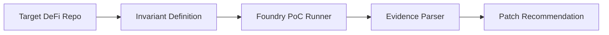
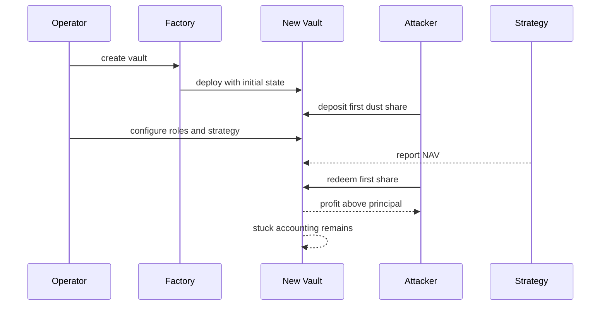

# Architecture

InvariantLab is a compact DeFi security research pipeline.

The first supported invariant class is vault launch safety. A vault should not accept the first external share before roles, limits, strategy configuration, and activation state are complete.

The MVP does not claim fully autonomous auditing. It packages a human-reviewed invariant into a repeatable verification loop.
